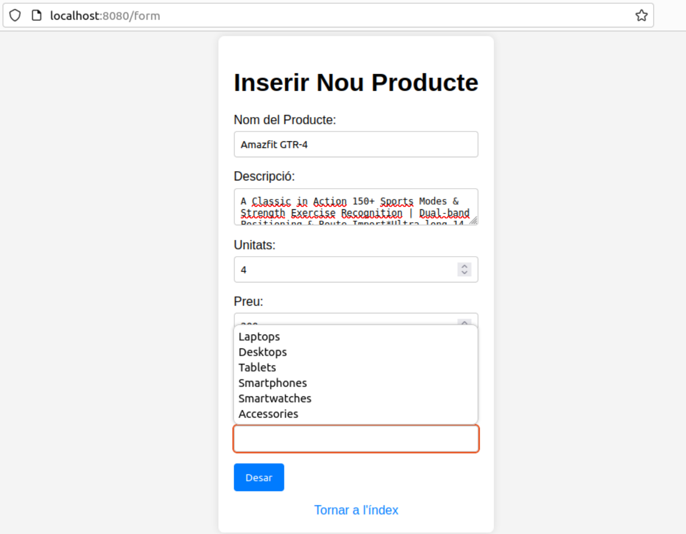

# Aplicació de Gestió de catàleg de productes

Aquesta aplicació permet als usuaris gestionar un catàleg de productes de manera eficient. Les funcionalitats principals inclouen:

## Consultar la llista de productes del catàleg

Quan cliquem l'enllaç de catàleg de productes, ens dirigim a una vista on es mostren tots els productes amb les seves característiques pertinents.

També podem borrar el producte des del catàleg des de l'acció borrar.

## Cercar productes per nom

Quan cliquem l'enllaç de cerca de productes, ens dirigim a una vista on podem omplir el camp de nom del producte. Els productes que coincideixin amb el nom introduït apareixeran amb les seves característiques detallades.

## Inserir un producte

Quan cliquem l'enllaç per inserir un producte, ens dirigim a una vista amb un formulari que podem omplir amb les característiques del producte que volem emmagatzemar a la base de dades. Aquesta vista inclou una ajuda a l'usuari que permet desplegar totes les subcategories disponibles, eliminant així les discrepàncies amb la subcategoria introduïda i evitant que l'usuari introdueixi una subcategoria inexistent.

Aquestes funcionalitats permeten una gestió eficient del catàleg de productes, assegurant que els usuaris poden visualitzar, cercar i afegir productes de manera intuïtiva i sense errors.
